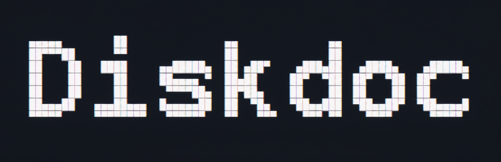

<p align="center">
  
</p>

A simple and lightweight tool for checking the health of storage devices, based on the smartctl command. The tool provides a quick, easy-to-read command that's always available. 

If you're feeling lazy, *you can let the AI run the analysis for you*. 


<p align="center">
  
</p>


## Requirements

- A computer with LinuxOS
- Root privileges

Very minimal :)

## Installation

### Quick install

You can install the program, using the installation script or you can compile it using gcc and make

```sh
./install.sh
```

Once installed, run it from anywhere with `sudo diskdoc`. If you want to use an AI model to perform the analysis, enter your API key in `/etc/diskdoc/.env` (created by `install.sh` from `.env-example`) — diskdoc reads it regardless of which directory it's run from.

### Manual build

```sh
make           
sudo make install   # copy it to /usr/local/bin/diskdoc
```

`PREFIX` defaults to `/usr/local` and can be overridden, e.g. `make install PREFIX=$HOME/.local`.

### Uninstall

```sh
sudo make uninstall
```

## Usage

```
Usage: diskdoc [-h] [-a] [-q] [i] [-d <device>]
       diskdoc -t <short|long> <device>

  -h, --help            show this help message and exit
  -a, --all             analyze every detected physical disk
  -q, --quiet           only print the summary line per disk, skip the detailed report
  -i, --ai              analyze a device with an AI model, using the API key set in /etc/diskdoc/.env
  -d, --device <name>   analyze a single device by kernel name (e.g. sda)
  -t, --test <mode>     start a short or long self-test on <device> (e.g. -t short nvme0)

With no options, diskdoc scans the disks and lets you pick one interactively.
-t cannot be combined with any other option.
```

**Since reading SMART data usually requires root, run diskdoc with `sudo`.**

### AI models

`-i/--ai` picks the provider from whichever API key is set in `.env`, and uses a fixed default model for it. diskdoc looks for a project-local `.env` first (walking up from the current directory, handy when running from a source checkout), then falls back to `/etc/diskdoc/.env` so it also works when launched from anywhere else:

| Provider  | Default model     |
|-----------|--------------------|
| OpenAI    | `gpt-4o-mini`      |
| Anthropic | `claude-sonnet-5`  |
| Gemini    | `gemini-1.5-flash` |

To use a different model, edit the corresponding `#define` in `include/dd_ai.h` (`OPENAI_DEFAULT_MODEL`, `ANTHROPIC_DEFAULT_MODEL`, `GEMINI_DEFAULT_MODEL`) and recompile with `make && sudo make install`.

### Exit codes

diskdoc exits with the severity of the worst finding across the analyzed disk(s), so it can be used in scripts and health checks:

| Code | Meaning                                   |
|------|--------------------------------------------|
| 0    | All checked values are OK                  |
| 1    | At least one value needs watching          |
| 2    | At least one value is in alarm             |
| 3    | diskdoc could not run (bad arguments, missing dependency, ...) |

---

### Credits

Special thanks to the authors of the libraries used in this project.

https://github.com/davegamble/cjson
